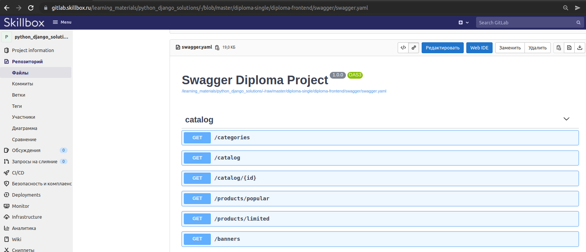

# Общая часть

## Что из себя представляет проект
Предтаавляет собой подключаемое django-приложение. Берет на себя все что связано с отобоажением страниц, а обращение 
за данными происходит по API, который необходимо реализовать в ходе выполения задания дипломного проекта.

## Контракт для API
Названия роутов и ожидаемую структуру ответа от API endpoints можно найти в `diploma-frontend/swagger/swagger.yaml`. 
Для более удобного просмотра swagger-описания рекомендуется использовать возможности gitlab:


## Подключение пакета
1. Собрать пакет: в директории diploma-frontend выполнить команду python setup.py sdist
2. Установить полученный пакет в виртуальное окружение: `pip install diploma-frontend-0.6.tar.gz`. X и Y - числа, они могут изменяться в зависимости от текущей версии пакета.
3. В `settings.py` дипломного проекта подключить приложение:
```python
INSTALLED_APPS = [
        ...
        'frontend',
    ]
```
4. В `urls.py` добавить:
```python
urlpatterns = [
    path("", include("frontend.urls")),
    ...
]
```
Если запустить сервер разработки: `python manage.py runserver`, то по адресу `127.0.0.1:8000` должна открыться стартовая страница интернет-магазина:


